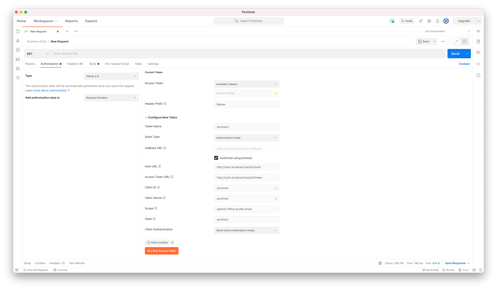
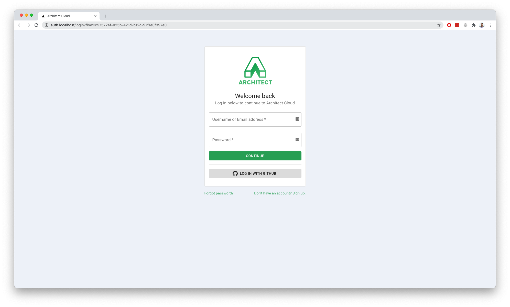
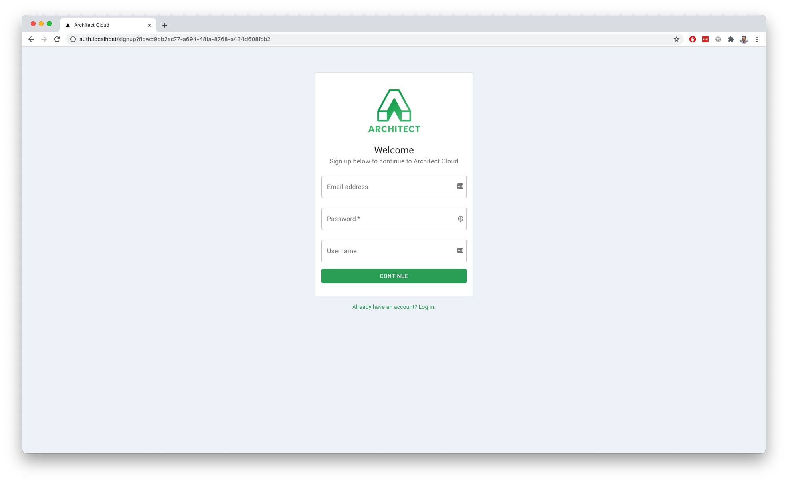
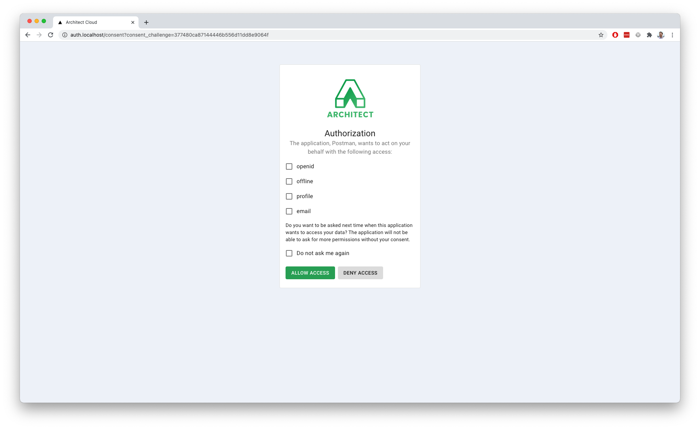
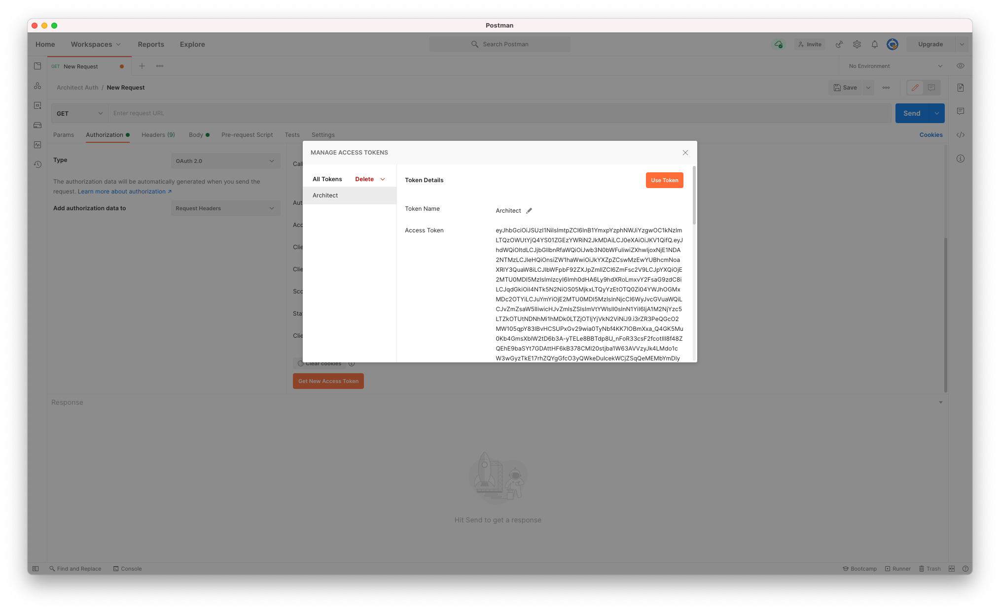
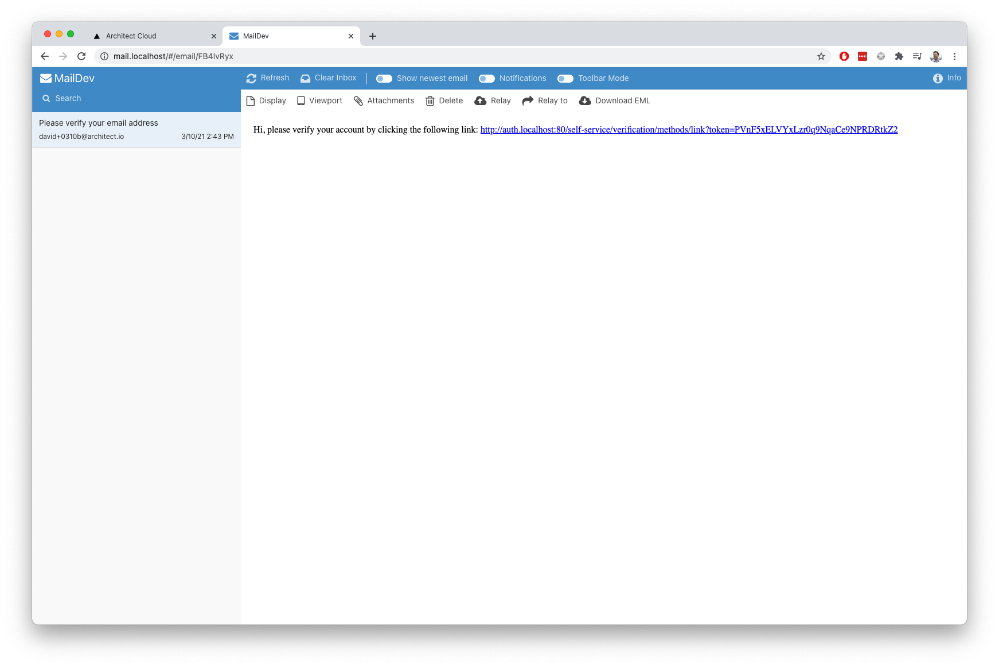

<p align="center">
  <a href="//architect.io" target="blank"></a>
</p>

<p align="center">
  A dynamic microservices framework for building, connecting, and deploying cloud-native applications.
</p>

---

# Architect Auth

A self-hosted user authentication and authorization component. This component is designed to replace the usage of hosted tools like Okta and Auth0 with a solution you can host yourself. This stack is built on top of the open-source identity solutions by [Ory](https://www.ory.sh/), [Hydra](https://www.ory.sh/hydra/) and [Kratos](https://www.ory.sh/kratos/).

## Getting Started

This component uses [Architect](https://www.architect.io/) for deployments and integration. Before you can begin, you must download the Architect CLI:

_Note: Architect's CLI requires [Docker and docker-compose](https://docs.docker.com/get-docker/)._

```sh
$ npm install -g @architect-io/cli
```

Once installed, you can clone the repo and then run the component with the following commands:

```sh
$ git clone https://github.com/architect-team/architect-auth.git && cd ./architect-auth/
$ architect deploy --local architect.yml -i auth:auth -i hydra:hydra-admin -i kratos:kratos-admin -i mail:mail
```

## Authentication using Postman

Once the stack has fully booted up, you'll need to create an OAuth client that is allowed to trigger the OAuth flow. This can be done using [Hydra's CLI](https://www.ory.sh/hydra/docs/guides/oauth2-clients), but lets start by creating a client for a Postman request using cURL and the Hydra Admin API:

```sh
curl --location --request POST 'http://localhost/clients' \
  --header 'Content-Type: application/json' \
  --header 'Host: hydra.localhost' \
  --data-raw '{
    "client_id": "postman",
    "client_name": "Postman",
    "client_secret": "postman",
    "redirect_uris": ["https://oauth.pstmn.io/v1/callback"],
    "grant_types": ["authorization_code", "refresh_token"],
    "response_types": ["code"],
    "scope": "offline offline_access refresh_token openid email profile",
    "audience": ["my-audience"],
    "token_endpoint_auth_method": "client_secret_post"
  }'
```

Next, let's go ahead and kick off the OAuth flow from Postman. Select the Authorization tab from the request page, pick the OAuth 2.0 option, and copy in the following configuration options before clicking "Get New Access Token":



Great! You should have been successfully redirect to the authentication application in your browser and are ready to complete the oauth flow.

## Completing the OAuth flow

Once you've kicked off the OAuth flow, you'll eventually land on the login page:



You'll need to create an account before you can login, so click the link at the bottom right corner of the page to go to the registration flow.



Now that you've created an account, you should be redirect to the oauth consent page. This will render the details of the requesting application (in this case our Postman client), and will include the requested scopes for the user to opt-in to approve:



After you've accepted the OAuth scopes, you should be redirected back to the postman callback URL! This will notify the postman application of the successful completion, and you will see the parsed access_token ready to go:



Congratulations! You now have an end-to-end, self-hosted authentication component that you can run locally and in the cloud via Architect!

## Verifying email addresses

The Kratos API is configured to send out verification emails to the address used for account signup automatically. Since email delivery requires an SMTP server, we've configured Kratos to leverage the `architect/smtp` component as an outgoing mail server.

The default behavior for this SMTP component is to use the open-source [MailDev](https://github.com/maildev/maildev) service. This service comes with a Web UI that renders the intercepted outgoing emails. If you deployed using the command above, more specifically if you exposed the `mail` interface via `-i mail:mail`, you can reach this web UI by navigating to http://mail.localhost. When you've finished signup, navigate to the Maildev UI, find your verification email, and click the link in the email to complete your verification:



## FAQ

### How do I change the logo rendered on the login/signup page?

The logo rendered on the login and registration pages can be configured by setting the `LOGO_URL` parameter via Architect when you deploy:

```sh
$ architect deploy architect/auth -p LOGO_URL="<url-of-my-logo>"
```

In addition to configuring the logo for the login, registration, and verification pages, the consent page will dynamically update its logo to match the `logo_uri` of the OAuth client that requested login.

### How do I specify the name of my application for rendering on login/signup?

The application name shown on login and registration pages can be configured via the `APP_NAME` parameter via Architect when you deploy:

```sh
$ architect deploy architect/auth -p APP_NAME="My Custom App"
```

### How can I change the color of the buttons and links?

This application uses [Material UI Theming](https://material-ui.com/customization/theming/) to apply colors to common components like buttons and links. You can change the primary theme color by assigning a hex color value to the parameter `THEME_PRIMARY_COLOR`:

```sh
$ architect deploy architect/auth -p THEME_PRIMARY_COLOR="#ff0000"
```

### How do I configure the from address for outgoing emails?

The SMTP from address can be configured by setting a valid email address to the parameter named `SMTP_FROM_ADDRESS`:

```sh
$ architect deploy architect/auth -p SMTP_FROM_ADDRESS="no-reply@domain.com"
```
